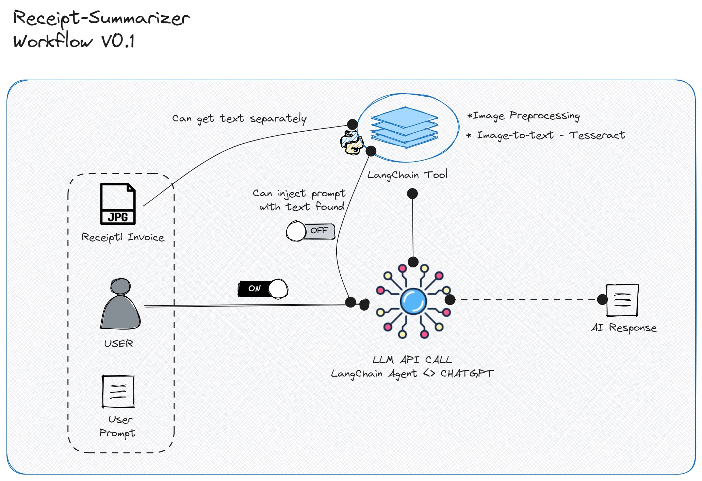

# invoice-LLM-summarizer


Invoice| Receipt analyzer using openCV+OCR+LLM 



- Images were obtained from google images
- A preprocessing module was included for images, (binarization, watermark removal)
- Pytesseract is used for as the default OCR engine
- LLM (OpenAI) - LangChain conversational agent which triggers a tool(functions-`AgentType.OPENAI_FUNCTIONS`) 


# How to Use

- Using a virtual env of your preference with python 3.9+ run the following

```bash
chmod +x setup.sh
pip install -r requirements.txt
```

- Create a `.env` file with your **OPENAI_API_KEY** in the root folder of this repo or append the key as an environment variable.

- A small script is provided to run a test, activate your environment and type the following:

```bash
python3 src/text_summarizer.py
```


    - Prompt: could you please tell me what products were bought in this receipt i'm attaching? return a python dictionary with all you find
    - AI: Based on the information extracted from the receipt, here is a Python dictionary with the products bought:

    ```python
    {
    "ZUMO TOMATE 500 o": "1",
    "PINTA CERVEZA 7.00": "13",
    "COCA COLA 5.00": "6",
    "AGUA LITRO CRISTAL 6,00": "3",
    "El TACO": "2",
    "ELTACO CANGREJO 1900": "2",
    "ALITAS PADRE 23,00": "1",
    "ROLL SALMON FLAMBEE 16,00": "1",
    "ROLL PLAYA PADRE 24,00": "1",
    "GUACAMOLE 16,00": "1",
    "EXTRA TOTOPOS 3.00": "2",
    "BUÚRGUER WAGYU 28,00": "1",
    "BURGUER WAGYU 28,00": "6",
    "CHUP. TEQUILA 64,00": "8",
    "CHUP. DON JULIO BLA 4": "8",
    "COLA ZERO : 5,00": "1",
    "MOET ICE 260.00": "2",
    "CAFE SOLO 40 o": "3",
    "CAFE CORTADO 4,00": "1",
    "MAGNUM DOM PERIGNON 1.000,00": "1",
    "AGUA PEO CRISTAL 5,00": "8",
    "CHARGE SERVICE 372,00": "1"
    }
    ```

The input can be in any language supported by the model in `src.config.PYTESSERACT_DEFAULT_CONFIG`

# Demo

See this [HF Space](https://huggingface.co/spaces/jhonparra18/receipt-llm-analyzer)

# Tests

Some unit tests were included, run `pytest` in the root folder.


# To do

Things one could work on or test are as follows:

- LLM summarization will heavily depend on the OCR output, this needs to be improved (Using different image preprocessing techniques as well as other OCR systems like PaddleOCR | cloud services)
- Agent performance is a concern, using sequentialChains or injecting OCR output to a chat model (ChatOpenAI) class instead of an agent could boost response times.
- Using a multimodal approach is the most appropiate way to go for this problem. Testing LLMs like GPT4 or open source like IDEFICS would be a good option. However, good old Regex should be the baseline approach.